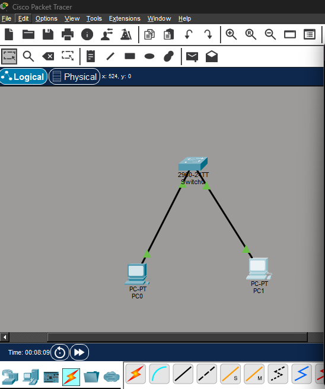
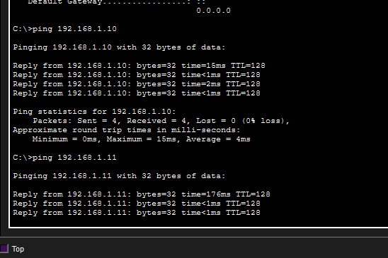

# Basic LAN Network (Cisco Packet Tracer)

##  Overview

This project demonstrates a simple Local Area Network (LAN) built using Cisco Packet Tracer. Two PCs are connected through a switch and configured with static IP addresses to enable communication within the same network.

---

##  Concepts Demonstrated

* IP Addressing (IPv4)
* Subnetting basics
* Layer 2 Switching
* End-to-end connectivity testing (Ping)

---

##  Topology

The network consists of:

* 1 Switch (2960)
* 2 PCs
* Copper Straight-Through connections

---

##  Configuration

### PC0

* IP Address: 192.168.1.10
* Subnet Mask: 255.255.255.0

### PC1

* IP Address: 192.168.1.11
* Subnet Mask: 255.255.255.0

---

##  Connectivity Test

A successful ping test was performed between PC0 and PC1.

Example:
PC0  ping 192.168.1.11

Result:
Reply received successfully.

---

##  Project Structure

01-basic-lan/
 basic-lan.pkt
 README.md
 screenshots/
 topology.png
 ping.png
 configs/
 pc0.txt
 pc1.txt

---

## 🧠 What I Learned

* Devices in the same subnet can communicate without a router
* Switches operate at Layer 2 and forward frames using MAC addresses
* Correct IP addressing is essential for connectivity
* Ping is a basic but powerful network troubleshooting tool

---

## 🚀 Next Steps

This project is the foundation for more advanced networking concepts such as VLANs, routing, and network segmentation.
