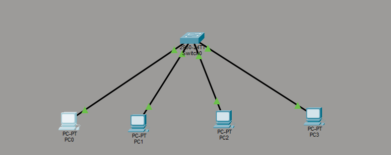
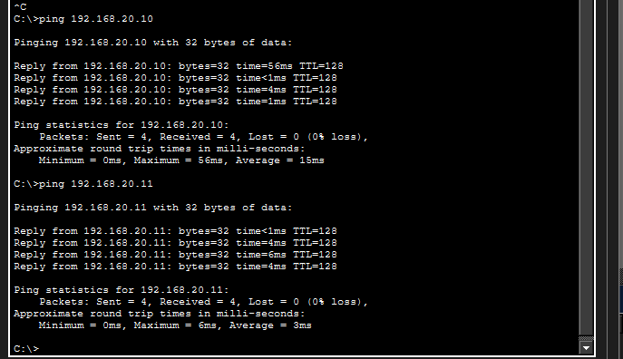
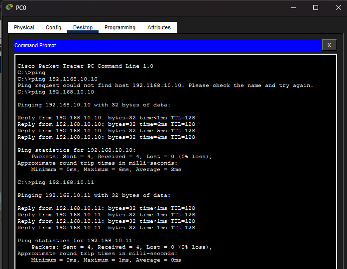
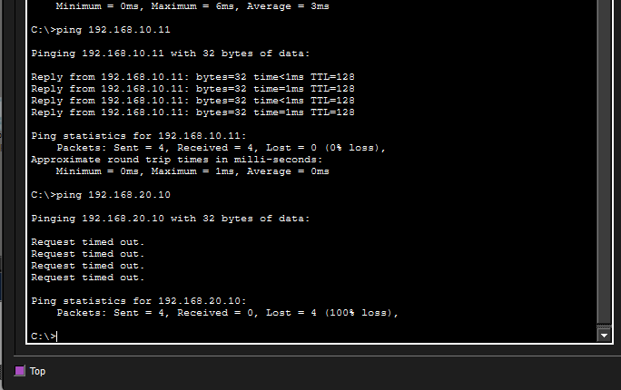
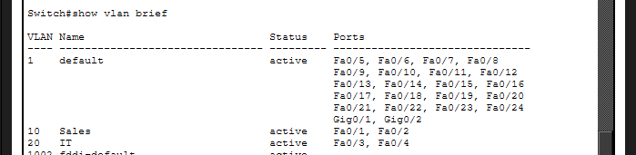

# VLAN Segmentation (Cisco Packet Tracer)

##  Overview

This project demonstrates VLAN segmentation using a single switch. Devices are grouped into separate VLANs to simulate isolated networks within the same physical infrastructure.

---

##  Concepts Demonstrated

* VLAN creation and management
* Port-to-VLAN assignment
* Network segmentation
* Layer 2 switching behavior

---

##  Topology

* 1 Switch (2960)
* 4 PCs
* VLAN 10 (SALES)
* VLAN 20 (IT)

---

##  Configuration

### VLANs Created

* VLAN 10  SALES
* VLAN 20  IT

### Port Assignments

* Fa0/1, Fa0/2  VLAN 10
* Fa0/3, Fa0/4  VLAN 20

---

##  IP Addressing

### VLAN 10 (SALES)

* PC0  192.168.10.10
* PC1  192.168.10.11

### VLAN 20 (IT)

* PC2  192.168.20.10
* PC3  192.168.20.11

Subnet Mask: 255.255.255.0

---

##  Connectivity Tests

### Same VLAN (Successful)

* PC0  PC1 
* PC2  PC3 

---

### Different VLAN (Failed)

* PC0  PC2 
* PC1  PC3 

---

##  VLAN Verification

Command used:
show vlan brief

---

##  What I Learned

* VLANs create logical network separation within a switch
* Devices in different VLANs cannot communicate without a router
* Switches operate at Layer 2 and do not perform routing
* Network segmentation improves organization and security

---

##  Next Steps

Implement inter-VLAN routing using a router (Router-on-a-Stick) to allow communication between VLANs.
