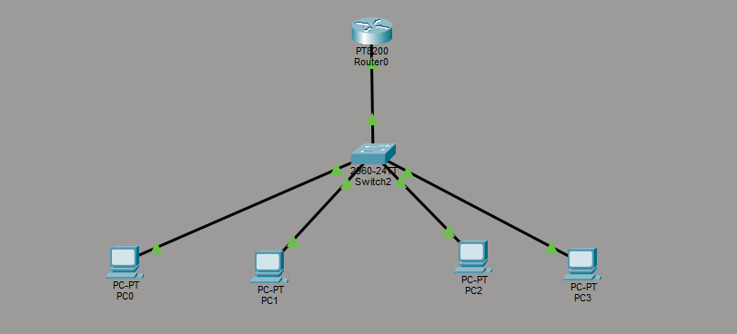
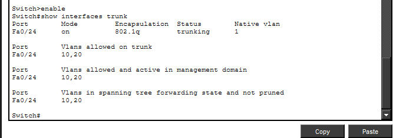
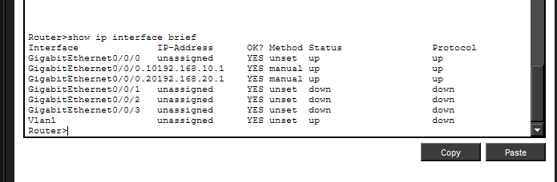
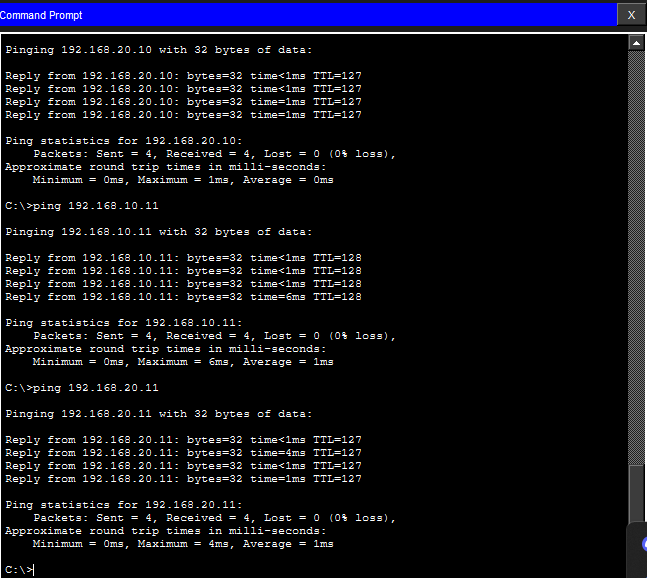

# Inter-VLAN Routing (Router-on-a-Stick)

##  Overview

This project demonstrates inter-VLAN routing using the Router-on-a-Stick method. VLANs are configured on a switch, and a router is used to enable communication between separate networks.

---

##  Concepts Demonstrated

* VLAN segmentation
* Trunking (802.1Q)
* Inter-VLAN routing
* Subinterfaces
* Default gateway configuration

---

##  Topology

* 1 Switch (2960)
* 1 Router
* 4 PCs
* VLAN 10 (SALES)
* VLAN 20 (IT)

---

##  Configuration

### VLANs

* VLAN 10  SALES
* VLAN 20  IT

### Port Assignments

* Fa0/1-2  VLAN 10
* Fa0/3-4  VLAN 20

---

##  Trunk Configuration

The switch port connected to the router is configured as a trunk:

---

##  Router Configuration

Subinterfaces are used to route between VLANs:

* g0/0/0.10  192.168.10.1
* g0/0/0.20  192.168.20.1

---

##  IP Addressing

### VLAN 10 (SALES)

* PC0  192.168.10.10
* PC1  192.168.10.11
* Gateway  192.168.10.1

### VLAN 20 (IT)

* PC2  192.168.20.10
* PC3  192.168.20.11
* Gateway  192.168.20.1

---

##  Connectivity Test

Successful communication between VLANs:

---

##  Key Insight

VLANs separate networks, while routers enable communication between them.

---

##  Outcome

This project demonstrates how enterprise networks use VLAN segmentation combined with routing to control and manage traffic efficiently.

##  Troubleshooting & Lessons Learned

During this project, several issues were encountered and resolved:

- Incorrect default gateway configuration on PCs
- Trunk port misconfiguration (access vs trunk)
- Router subinterface missing for VLAN 20
- Incorrect interface connection (used Fa0/1 instead of trunk port)

These issues were resolved through step-by-step debugging using:
- show vlan brief
- show interfaces trunk
- show ip interface brief

This reinforced the importance of verifying each layer of the network.
