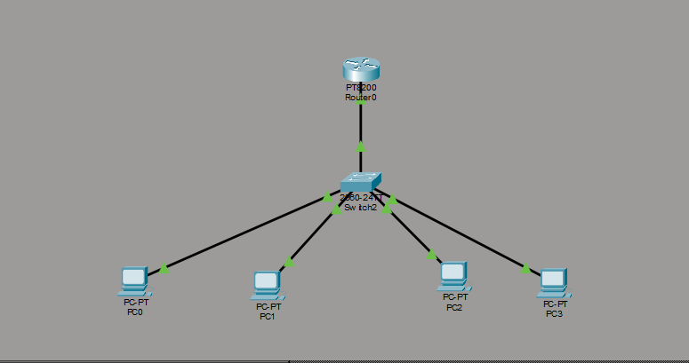
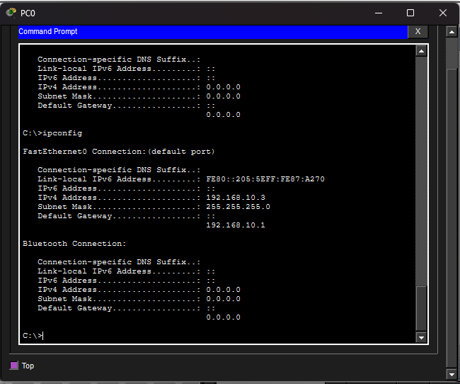
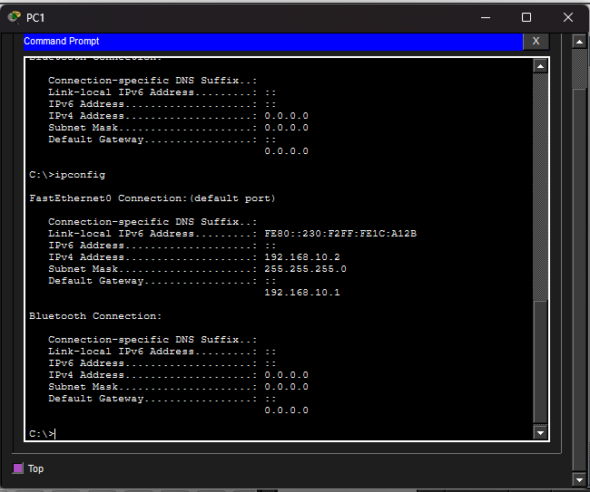
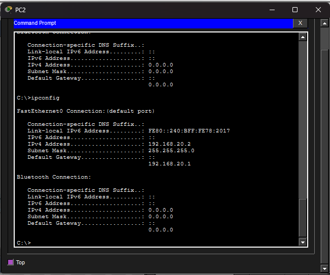
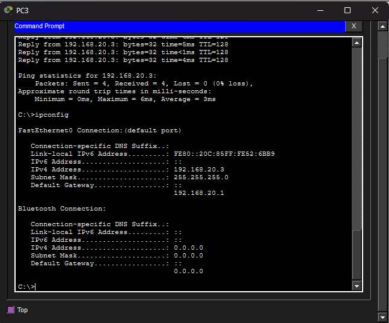
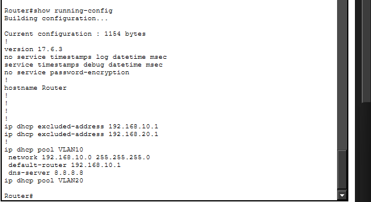
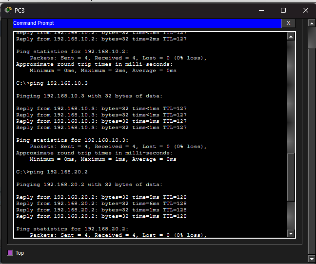

# DHCP Network (Cisco Packet Tracer)

##  Overview

This project demonstrates automatic IP address assignment using DHCP in a VLAN-segmented network. A router is configured to provide DHCP services for multiple VLANs.

---

##  Concepts Demonstrated

* DHCP configuration
* VLAN segmentation
* Inter-VLAN routing
* IP automation

---

##  Topology

* 1 Switch (2960)
* 1 Router
* 4 PCs
* VLAN 10 (SALES)
* VLAN 20 (IT)

---

##  Configuration

### DHCP Pools

* VLAN 10  192.168.10.0/24
* VLAN 20  192.168.20.0/24

### Excluded Addresses

* 192.168.10.1
* 192.168.20.1

---

##  Automatic IP Assignment

Devices receive IP addresses dynamically:

---

##  DHCP Verification

Router DHCP configuration:

---

##  Connectivity Test

Successful communication between VLANs using DHCP-assigned IPs:

---

##  Key Insight

DHCP simplifies network configuration by automating IP assignment while still relying on proper VLAN and routing configuration.

---

##  Outcome

This project demonstrates how enterprise networks automate device configuration using DHCP while maintaining segmented and routed network design.
