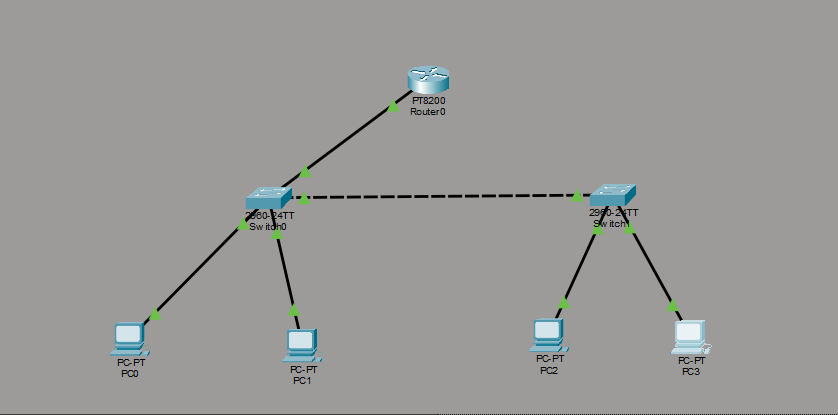
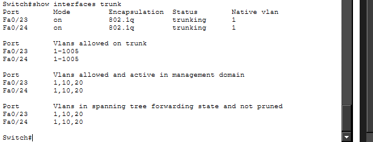
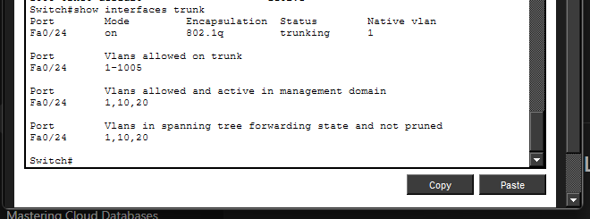
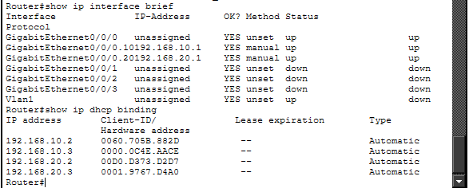
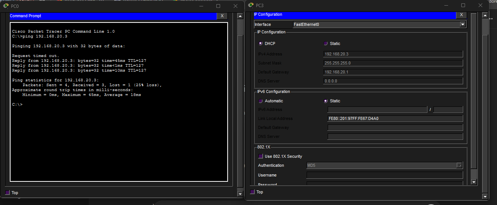

# Multi-Switch VLAN Network (Cisco Packet Tracer)

##  Overview

This project demonstrates VLAN communication across multiple switches using trunk links, combined with inter-VLAN routing and DHCP. It simulates a scalable enterprise network where multiple switches share VLANs and a centralized router provides routing and IP address assignment.

---

##  Concepts Demonstrated

* VLAN segmentation across multiple switches
* Trunking between switches (802.1Q)
* Router-on-a-Stick inter-VLAN routing
* DHCP per VLAN (automatic IP assignment)
* Network scalability

---

##  Topology

* 2 Switches (2960)
* 1 Router
* 4 PCs
* VLAN 10 (SALES)
* VLAN 20 (IT)

---

##  Trunk Links

### Switch-to-Switch Trunk

### Switch-to-Router Trunk

---

##  VLAN Configuration

| VLAN | Name  | Devices  |
| ---- | ----- | -------- |
| 10   | SALES | PC0, PC1 |
| 20   | IT    | PC2, PC3 |

---

##  Router Configuration

Subinterfaces:

* g0/0/0.10 → 192.168.10.1
* g0/0/0.20 → 192.168.20.1

---

##  DHCP Configuration

Each VLAN has its own DHCP pool:

* VLAN 10 → 192.168.10.0/24
* VLAN 20 → 192.168.20.0/24

---

##  DHCP Verification

---

##  Connectivity Test

Devices successfully communicate:

* Across switches
* Across VLANs

---

##  Key Insight

VLANs must be configured on all switches and connected via trunk links to allow communication across the network.

---

##  Outcome

This project demonstrates a scalable network design using multiple switches, VLAN segmentation, routing, and automated IP assignment.
